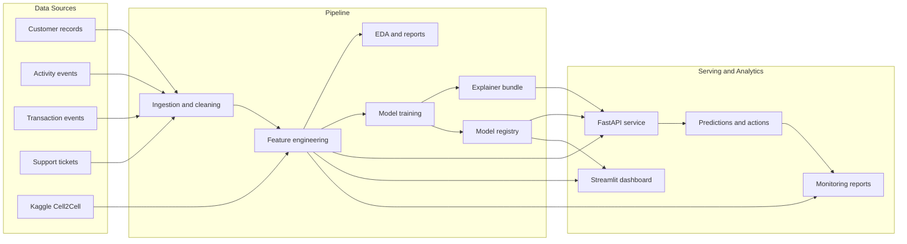
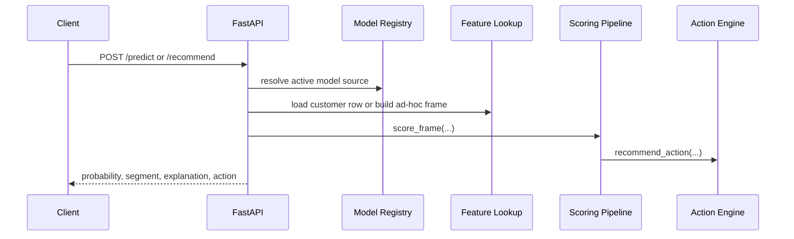
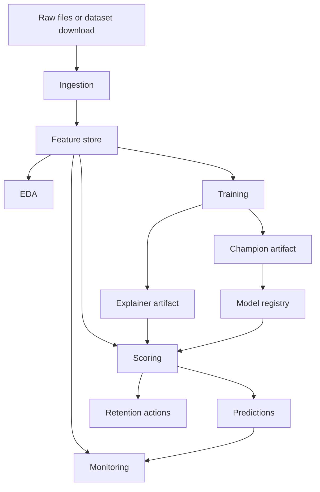

# Customer Churn Prediction

Customer Churn Prediction is an end-to-end churn analytics system for customer risk scoring, intervention planning, and operational monitoring. The repository includes synthetic-demo and real-dataset pipelines, a FastAPI inference service, a Streamlit dashboard, model explainability, retention action logic, and batch workflows for training, scoring, and monitoring.

It is designed around a simple operating model:

- ingest raw customer, activity, transaction, and support data
- engineer churn-oriented behavioral and commercial features
- train open-source models and register the active source
- serve predictions, explanations, and recommended actions
- monitor drift and performance over time

## Overview

### Core capabilities

- Batch ingestion and feature generation from CSV-based source data
- Two model sources:
  - `demo` for a fully synthetic end-to-end pipeline
  - `kaggle_cell2cell` for a real telecom churn workflow
- Candidate model training with Logistic Regression, Random Forest, and optional XGBoost and LightGBM
- Per-customer risk explanations plus global feature importance
- Retention action assignment with control and treatment split support
- FastAPI endpoints for scoring, explanation, and recommendation
- Streamlit command center for portfolio, customer, and action analysis
- Drift and performance monitoring artifacts for recurring evaluation

### System architecture



### Request flow



## Project layout

```text
.
├── .github/workflows/ci.yml
├── dashboard/                 Streamlit command center
├── data/                      Raw, processed, artifact, report, and database directories
├── scripts/                   Batch entrypoints for demo and real-data flows
├── src/
│   ├── api/                   FastAPI application and schemas
│   ├── datasets/              External dataset loaders
│   ├── features/              Cleaning, EDA, engineering, segmentation
│   ├── models/                Training, serving, scoring, registry, explainability
│   ├── monitoring/            Drift and performance evaluation
│   ├── retention/             Recommendation and experiment-group logic
│   └── utils/                 Config, IO, logging, database utilities
├── tests/                     Unit and API tests
├── Dockerfile.api
├── Dockerfile.dashboard
├── docker-compose.yml
└── pyproject.toml
```

## Data and model sources

The repository supports two parallel operating paths:

| Source | Purpose | Main entrypoint | Main outputs |
| --- | --- | --- | --- |
| `demo` | Full local walkthrough using generated data | `python3 scripts/bootstrap_demo.py` | `customer_features_latest.parquet`, `champion_model.joblib`, `predictions_latest.csv` |
| `kaggle_cell2cell` | Real churn workflow using the Cell2Cell dataset | `python3 scripts/run_kaggle_cell2cell_pipeline.py` | `kaggle_cell2cell_model.joblib`, validation predictions, holdout predictions |

The active source is tracked in `data/artifacts/model_registry.json`. The API and dashboard resolve that registry automatically unless a specific source is requested.

## Getting started

### Prerequisites

- Python 3.11 or newer
- `pip`
- Optional: virtual environment
- Optional: Docker and Docker Compose for containerized runs
- Optional: `libomp` on macOS if you want local XGBoost and LightGBM support

### Install

```bash
python3 -m venv .venv
source .venv/bin/activate
python3 -m pip install --upgrade pip
python3 -m pip install ".[dev]"
```

### Environment configuration

The default project paths already work locally. If you want an explicit environment file:

```bash
cp .env.example .env
```

Important defaults:

- database: `data/db/churn.sqlite3`
- artifacts: `data/artifacts/`
- processed datasets: `data/processed/`
- reports: `data/reports/`

## Running the project

### 1. Run the full demo pipeline

```bash
python3 scripts/bootstrap_demo.py
```

This executes:

1. synthetic data generation
2. ingestion and cleaning
3. exploratory analysis
4. model training
5. customer scoring
6. monitoring report generation

### 2. Run the real-data telecom pipeline

```bash
python3 scripts/run_kaggle_cell2cell_pipeline.py
```

This flow downloads or reuses the Kaggle Cell2Cell dataset, prepares labeled and holdout frames, trains a churn model, exports validation predictions, and produces holdout scoring output for downstream review.

### 3. Start the API

```bash
uvicorn src.api.app:app --reload
```

The API listens on `http://127.0.0.1:8000`.

### 4. Start the dashboard

```bash
streamlit run dashboard/app.py
```

The dashboard listens on `http://127.0.0.1:8501`.

### 5. Run with Docker

```bash
docker compose up --build
```

Container ports:

- API: `8000`
- Dashboard: `8501`

## Pipeline entrypoints

| Command | Purpose |
| --- | --- |
| `python3 scripts/generate_demo_data.py` | Generate synthetic raw datasets |
| `python3 scripts/ingest_data.py` | Clean, join, and persist feature inputs |
| `python3 scripts/run_eda.py` | Produce exploratory summaries and charts |
| `python3 scripts/run_training.py` | Train the demo-source model set and register the active model |
| `python3 scripts/run_scoring.py` | Score customers and assign actions |
| `python3 scripts/run_monitoring.py` | Compute drift and performance reports |
| `python3 scripts/run_kaggle_cell2cell_pipeline.py` | Execute the real-data telecom pipeline |
| `python3 scripts/bootstrap_demo.py` | Run the complete demo workflow in sequence |

### Batch lifecycle



## API surface

### Endpoints

| Method | Path | Purpose |
| --- | --- | --- |
| `GET` | `/health` | Liveness check |
| `GET` | `/ready` | Active model and source readiness |
| `GET` | `/sources` | Available model sources and current selection |
| `POST` | `/sources/activate` | Switch the active source |
| `GET` | `/model/info` | Return metadata for a specific or active model |
| `POST` | `/predict` | Return churn probability and segment |
| `POST` | `/explain` | Return churn probability and explanation bundle |
| `POST` | `/recommend` | Return churn probability and recommended intervention |

### Example request

```json
{
  "customer_id": "CUST-00001",
  "persist": false
}
```

### Example ad-hoc payload

```json
{
  "features": {
    "customer_id": "adhoc-1",
    "plan": "Basic",
    "country": "US",
    "acquisition_channel": "organic",
    "cohort_month": "2025-10",
    "customer_segment": "dormant_user",
    "tenure_days": 150,
    "monthly_revenue": 29,
    "recency_days": 24,
    "sessions_last_30d": 1,
    "active_days_last_30d": 1,
    "frequency_per_week": 0.2,
    "duration_minutes_last_30d": 12,
    "feature_usage_count_90d": 1,
    "feature_adoption_ratio": 0.16,
    "drop_off_points": 5,
    "avg_events_per_session": 2,
    "activity_trend_slope": -1.2,
    "avg_payment_delay_days": 8,
    "failed_transactions_180d": 2,
    "monetary_value_90d": 29,
    "avg_invoice_amount": 29,
    "tickets_90d": 2,
    "avg_resolution_hours": 56,
    "avg_ticket_csat": 2.9,
    "open_tickets_90d": 1,
    "rfm_recency": 24,
    "rfm_frequency": 1.2,
    "rfm_monetary": 29,
    "engagement_score": 9.5,
    "activity_decay_flag": 1,
    "payment_risk_flag": 1,
    "support_risk_flag": 1,
    "churn_risk_heuristic": 0.81
  }
}
```

## Dashboard

The Streamlit application exposes four working views:

- `Overview` for portfolio-level KPIs and top metrics
- `Customer Explorer` for record-level inspection
- `Insights` for distribution, risk, and feature-level analysis
- `Action Center` for intervention review and action queues

The dashboard can resolve the active source automatically or display the latest available source if no explicit active model has been registered yet.

## Modeling approach

### Feature groups

The feature pipeline combines:

- tenure and cohort context
- engagement and activity intensity
- revenue and payment behavior
- support volume and satisfaction indicators
- RFM-style customer value signals
- heuristic risk flags derived from observed patterns

### Candidate models

The training workflow evaluates:

- Logistic Regression
- Random Forest
- XGBoost when runnable in the local environment
- LightGBM when runnable in the local environment

The top model is selected from holdout and cross-validation metrics, then persisted as the active scoring bundle.

### Explainability

- Global importance is aggregated from the trained pipeline output
- Per-customer explanations are exposed through an explainer bundle
- The system keeps a logistic-regression explainer for stable, business-readable risk factor messaging even when another model becomes champion

### Retention logic

The recommendation engine maps churn probability into `low_risk`, `medium_risk`, and `high_risk` segments. It then assigns actions such as discount offers, support outreach, feature adoption journeys, or nurture campaigns based on observed payment, support, and engagement patterns.

For intervention measurement, medium-risk and high-risk actions are split into deterministic control and treatment groups using a customer-and-batch hash.

## Monitoring and reporting

Monitoring output focuses on:

- feature drift through baseline mean and missing-rate comparisons
- classification metrics when ground-truth labels are available
- calibration-style metrics such as Brier score
- prioritization value through top-decile lift and recall

Typical report and artifact outputs include:

| Output | Location |
| --- | --- |
| SQLite database | `data/db/churn.sqlite3` |
| Processed demo features | `data/processed/customer_features_latest.parquet` |
| Processed Cell2Cell features | `data/processed/kaggle_cell2cell_*_latest.parquet` |
| Champion model artifact | `data/artifacts/champion_model.joblib` |
| Explainer artifact | `data/artifacts/explainer_model.joblib` |
| Model registry | `data/artifacts/model_registry.json` |
| Demo predictions | `data/reports/predictions_latest.csv` |
| Demo leaderboard | `data/reports/model_leaderboard.json` |
| Feature importance export | `data/reports/feature_importance_latest.csv` |
| Cell2Cell validation predictions | `data/reports/kaggle_cell2cell_validation_predictions.csv` |
| Cell2Cell holdout predictions | `data/reports/kaggle_cell2cell_holdout_predictions.csv` |
| Monitoring report | `data/reports/monitoring_latest.json` |

## Testing and CI

Run the test suite locally with:

```bash
pytest -q
```

The repository includes a GitHub Actions workflow in `.github/workflows/ci.yml` that installs the package and runs the test suite on pushes, pull requests, and manual dispatch.

## Notes

- The Docker images currently use Python `3.13`, while local development and CI support Python `3.11+`.
- If XGBoost or LightGBM are unavailable locally, the training flow still runs with Logistic Regression and Random Forest.
- API and dashboard behavior depend on generated artifacts. Run one of the training pipelines before expecting scoring and model metadata endpoints to be ready.
